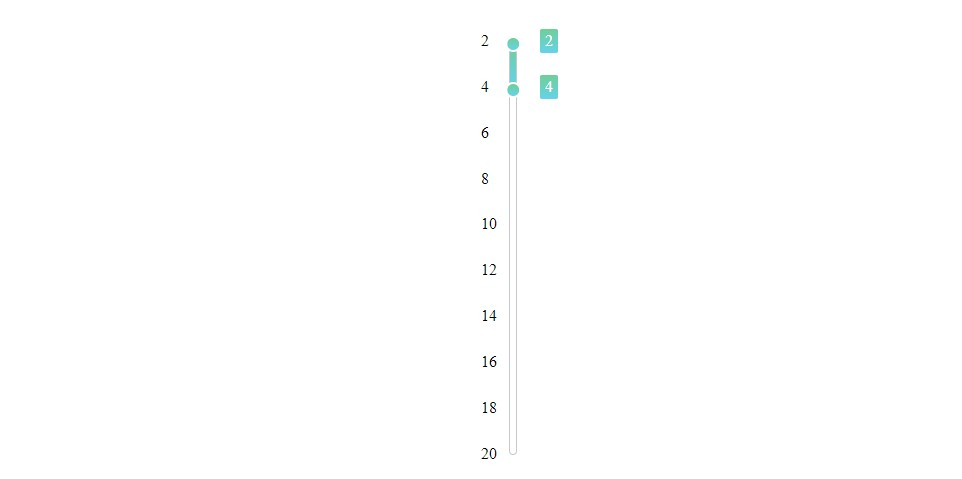

# Slider-mvp: плагин бегунка для JQuery

Плагин slider ("бегунок") для JQuery - позволяющий с помощью рычажков выставлять необходимое значение (или диапазон значений). [Демо](https://webbomj.github.io/slider-mvp/)



## Задание 4 от Metalamp

Задание заключается в написании плагина для jQuery, который бы реализовывал функционал «бегунка» (также называемого слайдером) — специальный контрол, который позволяет перетягиванием задавать какое-то числовое значение.
[ссылка на задание](https://coda.io/@metalamp/education/front-end-2)<br>

## Архитектура

Плагин построен по подобию MVP архитектуры. Где представление и бизнес логика не знаю ничего друг о друге. В этом помогает патерн `observer`, который позволяет подписываться на события и оповещать подписавшихся. <br>

### Model (Модель)

Model - отдельный модуль, работающий с бизнес данными. Она состоит из бизнес данных (state), обработчика (reducer по типу Flux-Redux) принимающего action object, на изменения в модели можно подписаться, модель может отдать данные с помощью метода `getState()`.<br>

### View (Отображение)

View - отдельный модуль, работающий с построением визуальной части в DOM дереве из разных дочерних (subView) модулей. Само представление разбито на небольшие модули (subView). Дочерние модули ничего не знают о View, с помощью однонаправленного потока данных, они имеют актуальные данные. <br>

На View можно подписаться. При работе со слайдером, view отправит оповещение подписчикам об изменениях. Изменения обрабатываются и передаются в модель, далее данные передаются через оповещение presenter во view и обновляет точечно DOM.<br>

### Presenter (Ведущий)

Presenter - модуль обработчик, который обрабатывает данные пришедшие с View и отправляет обработанные данные в model, и обрабатывает данные пришедшие с model, затем отсылая их во View.<br>

Создает из пришедших данных Model и View.<br>
Подписывается на их изменения.<br>
Обрабатывает изменения Model и передает их во View.<br>
Обрабатывает изменения View и передает их в Model.<br>
На него можно подписаться, и при изменении данных слайдера, он выдаст актуальный стейт. <br>

## Возможности

-Простое взаимодействие со слайдером (подключил и забыл)<br>
-Полностью подстраивается под ширину/высоту контейнера<br>
-Поддерживает Pointer события (для работы на touch устройствах)<br>
-Возможность работать с отрицательными значениями<br>
-Возможность подписаться на изменения слайдера<br>
<br>
-Возможность кастомизировать:<br>
-шаг<br>
-расположение (горизонтальное/вертикальное)<br>
-начилие прогресс бара<br>
-наличие лейбла (значения над ползунком)<br>
-наличие шкалы<br>
-наличие интервала значений<br>

## Развертывание

Клонируете репозиторий командой:

```bash
git clone https://github.com/webbomj/slider-mvp.git
```

Устанавливаете зависимости:

```bash
npm install
```

Собираете проект:

```bash
npm run build
```

Из папки dist переносите скрипт слайдера `slider.js` и стили к нему `slider.css`.<br>
Для использования плагина нужно установить JQuery версии не ниже 3.<br>
Далее подключаете плагин и стили, например вот так:

```js
import "./script.js";
import "./script.css";
```

Далее вызываете сам слайдер в нужный вам контейнер с помощью JQuery:

```html
<div id="app"></div>
```

```js
$("app").slider(options);
```

Где options это параметры слайдера.<br>
Можно передать все параметры, а можно только частично.<br>
При добавлении параметров частично слайдер добавит их к параметрам по умолчанию.<br>
После получения параметров происходит их валидация, если значения не валидны, выдается ошибка с указанием на конкретное несоответствие.<br>

## Параметры

|      Опции      |   Тип   | По-умолчанию |                                          Описание                                          |
| :-------------: | :-----: | :----------: | :----------------------------------------------------------------------------------------: |
|      `min`      | number  |     `0`      |                               Минимальное значение слайдера                                |
|      `max`      | number  |    `100`     |                               Максимальное значение слайдера                               |
|     `from`      | number  |     `20`     |       Начальное значение бегунка если есть опция `isInterval`, иначе не показывается       |
|      `to`       | number  |     `30`     |                                 Конечное значение бегунка                                  |
|     `step`      | number  |     `1`      |                                        Шаг слайдера                                        |
|   `stepScale`   | number  |     `1`      |                                     Шаг шкалы слайдера                                     |
|  `isVertical`   | boolean |   `false`    |            Ориентация слайдера, по умолчанию слайдер в горизонтальном положении            |
|  `isInterval`   | boolean |   `false`    |                Тип слайдера: одиночные или интервал. ПО умолчанию одиночный                |
|    `isLabel`    | boolean |    `true`    |        Показывать ли табличку со значением над ползунком. По умолчанию показывать.         |
|    `isScale`    | boolean |    `true`    |                   Показывать ли шкалу слайдера. По умолчанию показывать.                   |
| `isProgressBar` | boolean |    `true`    | Показывать заливку между `from` и `to` при включенном `isInterval`, иначе от `min` до `to` |

## Примеры подключения:

```html
<div id="app"></div>
```

```js
$("#app").slider({}); // без передачи опций, будут использоваться значения по умолчанию
$("#app").slider({ max: 200 }); // частичная передача опций
$("#app").slider({
  min: 2,
  max: 20,
  from: 2,
  to: 4,
  step: 2,
  stepScale: 2,
  isVertical: true,
  isInterval: true,
  isLabel: true,
  isScale: true,
  isProgressBar: true,
}); // полная передача опций
```

## Подписка на изменения слайдера

С помощью паттерна `observer` вы можете подписаться на изменения слайдера<br>
Подписка происходит через метод `subscribe()`<br>
В этот метод передается функция, которая должна принимать объект соответствующий параметра слайдера.<br>

```html
<div id="app"></div>
```

```js
const slider = $("#app").slider({});
const fn = (model) => {
  console.log(model);
};
slider.subscribe(fn);
```

## Команды:

`npm run dev` - разработка<br>
`npm run test:coverage` - покрытие тестами<br>
`npm run build` - сборка проекта<br>
`npm test` - тесты<br>

## UML диаграмма классов


## Инструменты которые использовались для разработки:

-Node js 16.13.1 <br>
-Typescript 4.5.4 <br>
-Parcel 2.6.2 <br>
-JQuery: 3.6.0 <br>
-SCSS - 1.49.0 <br>
-Jest : 28.1.3 <br>
-JsDom: 28.1.3 <br>
